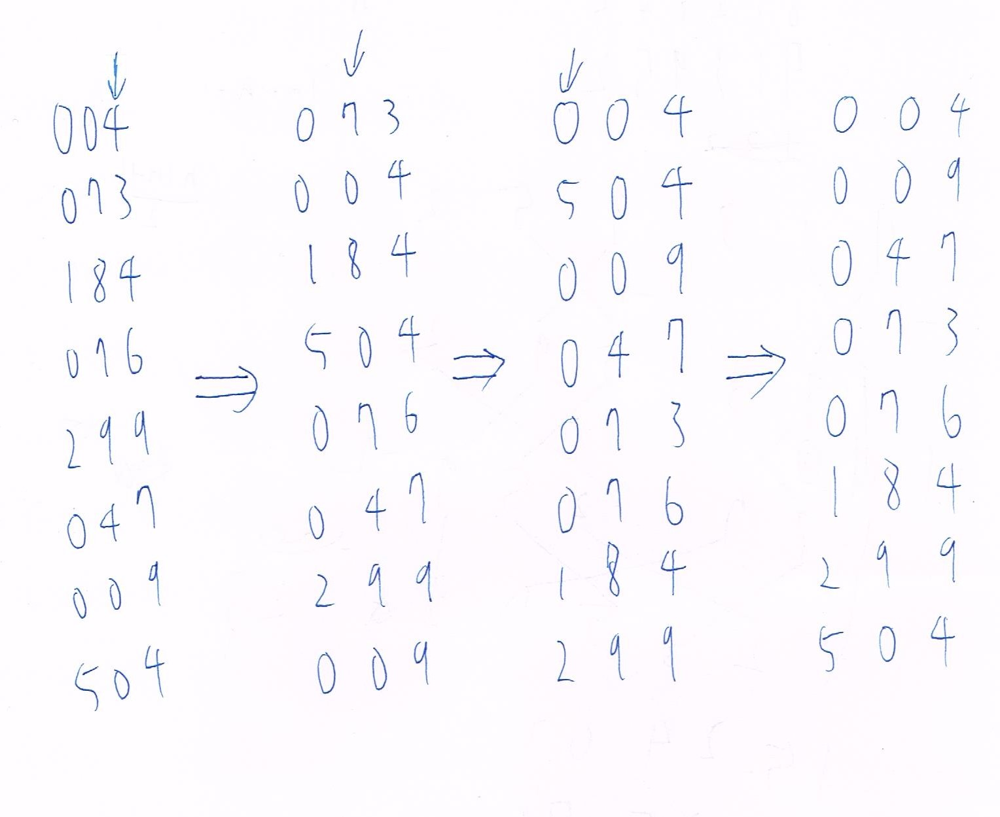

## B10902033 林祐辰 DSA HW-2  
### Problem 0:  
1. https://www.geeksforgeeks.org/merge-sort/
2. 廖奕鈞 B10902034
3. 廖奕鈞 B10902034
4. 李沛宸 B10902032
5. 李沛宸 B10902032
### Problem 1:  
1. 7 Pairs: (P0, P3), (P1, P2), (P1, P3), (P1, P4), (P1, P5), (P2, P3), (P2, P4)  
2. Algorithm:  
   ```C
   int pairs = n * (n - 1) / 2;
   void merge(int array[], int left, int mid, int right){
      int subArrayOne = mid - left + 1;
      int subArrayTwo = right - mid;
  
      int leftArray[subArrayOne];
      int rightArray[subArrayTwo];

      for(int i = 0; i < subArrayOne; i++){
         leftArray[i] = array[left + i];
      }
      for (int j = 0; j < subArrayTwo; j++){
         rightArray[j] = array[mid + 1 + j];
      }
  
      int indexOfSubArrayOne = 0;
      int indexOfSubArrayTwo = 0;
      int indexOfMergedArray = left;
      while(indexOfSubArrayOne < subArrayOne && indexOfSubArrayTwo < subArrayTwo){
         if(leftArray[indexOfSubArrayOne] <= rightArray[indexOfSubArrayTwo]){
            array[indexOfMergedArray] = leftArray[indexOfSubArrayOne];
            indexOfSubArrayOne++;
         }
         else{
            array[indexOfMergedArray] = rightArray[indexOfSubArrayTwo];
            indexOfSubArrayTwo++;
            pairs = pairs - (subArrayOne - indexOfSubArrayOne);   //O(1) operation added
         }
         indexOfMergedArray++;
      }
      while(indexOfSubArrayOne < subArrayOne) {
         array[indexOfMergedArray] = leftArray[indexOfSubArrayOne];
         indexOfSubArrayOne++;
         indexOfMergedArray++;
      }
      while (indexOfSubArrayTwo < subArrayTwo) {
         array[indexOfMergedArray] = rightArray[indexOfSubArrayTwo];
         indexOfSubArrayTwo++;
         indexOfMergedArray++;
      }
   }

   void mergeSort(int array[], int begin, int end){
      if(begin >= end){
         return;
      }
      int mid = begin + (end - begin) / 2;
      mergeSort(array, begin, mid);
      mergeSort(array, mid + 1, end);
      merge(array, begin, mid, end);
   }
   ```  
   The time complexity is O(n * log n) because the time complexity of merge sort is O(n * log n), and the operation I add is O(1).  
   The algorithm works by counting the pairs that is not feasable during the merge sort and deduct them.
3. (a) The difficulties of problems that would be remove are: 4, 5, 2, 3.  
   (b) The time complexity is O(n^2), because the worst case is to remove a pair every time till len(P) = 0, so the outer while loop while be run atmost n/2 times, and the two operation in the outer while loop are Ordered(P) and the inner while loop which are both O(n). So the time complexity is O(n^2).
4. Prove: When we remove a pair there will be at most one element that is in the order so there will be at most 2k problems be removed.
5. Algorithm:
   ```C
   Remove-out-of-order-pairs(Problem P[]):
      i = 0
      while (i+1 < len(P)):
         if (P[i].difficulty > P[i+1]. difficulty):
            remove(P[i])
            remove(P[i])
            i -= 1
         else:
            i += 1
   ```  
   The time complexity is O(n) cause the while loop iteration is at most n cause remove two elements and i -= 1 equals to i += 1.  
   The Algorithm works because the pairs that maybe possibly miss count must be the pair that touch together after removing a pair.
6. Algorithm:
   ```C
   Find-in-order-problems(n, P[]):
      out_of_order_arr[n]
      i = 0, j = 0
      while (i+1 < len(P)):   // O(n)
         if (P[i].difficulty > P[i+1]. difficulty):
            out_of_order_arr[j] = P[i]
            out_of_order_arr[j+1] = P[i+1]
            remove(P[i])
            remove(P[i])
            i -= 1
            j += 2
         else:
            i += 1
      mergesort(out_of_order_arr)   // O(k * log k)
      merge(P, out_of_order_arr)    // O(n)
   ```
   The time complexity is O(n + k * log k), cause the while loop is O(n), and there is at most 2k problems be remove to out_of_order_arr and time complexity of merge sort would be O(2k * log 2k) which is O(k * log k), and time complexity of merging n elements is O(n).  
   The algorithm works by taking out at most 2k element that is unsorted and sort them by using merge sort and merge the sorted ones together. (merge sort and merge function refers to the one in P1-1)
### Problem 2:
1. Algorithm:
   ```C
   d = |character set|
   q = big constant
   Rabin-Karp-Matcher(T, l, hash_p, h):
      x = d^(h-1) mod q    // O(h)
      t = 0
      for i = 0 to h:
         t = (d * t + T[i]) mod q
      for i = 0 to l-h:
         if hash_p == t:   // No collision
            return 1
         t = (d * (t - T[i+1] * x) + T[i+h+1]) mod q
      return 0
   find_correct_maps(k, m, n, h, maps[k][n][m], pattern[h]):
      stack ans
      hash_p = 0
      for i = 0 to h:
         hash_p = (d * hash_p + pattern[i]) mod q
      for i = 0 to k-1:
         for j = 0 to n-1:
            T = strcat(maps[i][j], maps[i][j])  // O(M)
            if Rabin-Karp-Matcher(T, T.length, hash_p, h) == 1:
               push(ans, i)
      return ans
   ```
2. The time complexity is O(K * M * N + h), because there is no collision in rabin-karp-matcher so the worst case time complexity is O(M + h), and h <= M so O(K * (M + h) * N + h) = O(K * M * N + h).
3. Algorithm:
   ```C
   d = |character set|
   q = big constant
   D = another constant
   Rabin-Karp-Matcher(n, m, T[n][2m], g, h, hash_p):
      x = d^(h-1) mod q
      y = D^(g-1) mod q
      t[n][2m-h] = 0
      for i = 0 to n-1:
         for j = 0 to h:
            t[i][0] = (d * t[i][0] + T[i][j]) mod q
      for i = 0 to n-1:
         for j = 1 to 2m-h:
            t[i][j] = (d * (t[i][j] - T[i][j+1] * x) + T[i][j+h+1]) mod q

      hash_t[n-g][2m-h] = 0
      for i = 0 to 2m-h:
         for j = 0 to g:
            hash_t[0][i] = (D * hash_t[0][i] + t[j][i]) mod q
      for i = 0 to 2m-h:
         for j = 1 to n-g:
            hash_t[j][i] = (D * (hash_t[j][i] - t[j][i+1] * y) + t[j][i+g+1]) mod q

      for i = 0 to n-g:
         for i = 0 to 2m-h:
            if hash_t[i][j] == hash_p:
               return 1 
      return 0

   find_correct_maps(k, m, n, g, h, maps[k][n][m], pattern[g][h]):
      stack ans
      hash_p = 0
      for i = 0 to g:
         tmp = 0
         for j = 0 to h:
            tmp = (d * tmp + pattern[i][j]) mod q
         hash_p = (D * hash_p + tmp) mod q

      for i = 0 to k-1:
         for j = 0 to n-1:
            T[j] = strcat(maps[i][j], maps[i][j])
         
         if Rabin-Karp-Matcher(n, m, T, g, h, hash_p) == 1:
            push(ans, i)
      return ans
   ``` 
   The Algorithm works by squeezing the map, first squeeze the map in vertical way and get its rabin-karp which stores it in t, and then calculate the hash_t by the same way(similar method in P2-1) but in different direction.And last check if a map has the same hash value as the pattern hash value.

4. The time complexity is O(K * M * N + g * h), because by using the method in P2-1 the time complexity for finding hash value for both t and hash_t is O(M * N), and for checking pattern is also O(M * N), and there is K planet so the time complexity is O(K * M * N + g * h).
5. Similar algorithm as P2-3 in a special case which g = N and h = M.
6. Refer to P2-4 the time complexity would be O(K * M * N + N * M) which equals to O(K * M * N).
### Problem 3:
1. Process:  
     
2. Algorithm:
   ```C
   void CountingSort (int A[], int n, int B[], int K) {
	   int C[K], i, j,;
	   for (i=0;i<=K;i++)
		   C[i]=0;
	   for (j=1;j<=n;j++)
		   C[A[j]]=C[A[j]]+1;
	   for (i=1;i<=K;i++)
		   C[i]=C[i]+C[i-1];
	   for (j=n;j>=1;j--) {
		   B[C[A[j]]]=A[j];
		   C[A[j]]--;	
	   }
   }
   CountingSort(egg_label, N, sorted_egg_label, 10000000);
   ```
   The space complexity is O(10^7 + N).  
   The time complexity is O(N) by using counting sort.
3. Algorithm:
   ```C
   libra(egg1, egg2):
      if egg1.label > egg2.label:
         return 1
      else:
         return 2
   Sort_egg(n, egg[]):
      stack hole
      sorted_egg[n]
      j = 0
      push(hole, egg[0])
      i = 1
      while i < n:
         if libra(peep(hole), egg[i]) == 1:
            push(hole, egg[i])
            i++
         else:
            sorted_egg[j] = pop(hole)
            j++
            if hole is empty:
               push(hole, egg[i])
               i++
      while hole is not empty:
         sorted_egg[j] = pop(hole)
            j++
   ```
   The Algorithm works because there is no type one sequence, so is the egg label is larger then the stack_top label, then it is for sure to be the smallest element among the ones that haven't been put in the stack and the ones in the stack, so I can pop it to the sorted_egg.
4. Algorithm:
   ```C
   libra(egg1, egg2):
      if egg1.label > egg2.label:
         return 1
      else:
         return 2
   Sort_egg(n, egg[]):
      stack stack_1, stack_2
      sorted_egg[n]
      push(stack_1, egg[0])
      for i = 1 to n-1:
         if libra(peep(stack_1), egg[i]) == 1:
            push(stack_1, egg[i])
         else:
            push(stack_2, egg[i])
      for i = 0 to n-1:
         if stack_1 is empty:
            sorted_egg[i] = pop(stack_1)
         else if stack_2 is empty:
            sorted_egg[i] = pop(stack_2)
         else:
            sorted_egg[i] = peep(stack_1) < peep(stack_2) ? pop(stack_1) : pop(stack_2)
   ```
   The algorithm works by insuring every stack have the property that the labels increase from the top to the bottom, so the smallest label must be at the top among the stacks.
5. Algorithm:
   ```C
   libra(egg1, egg2):
      if egg1.label > egg2.label:
         return 1
      else:
         return 2
   Sort_egg(n, egg[], k):
      stack stack[k]
      sorted_egg[n]
      for i = 0 to n-1:
         for j = 0 to k-1:
            if stack[j] is empty:
               push(stack[j], egg[i])
               break
            else if libra(peep(stack[j]), egg[i]) == 1:
               push(stack[j], egg[i])
               break
      for i = 0 to n-1:
         min = 10000000
         min_index = 0
         for j = 0 to k-1:
            if stack[j] is empty:
               continue
            if peep(stack[j] < min):
               min = stack[j]
               min_index = j
         sorted_egg[i] = pop(stack[min_index])
   ```
   The algorithm works by the same idea of P3-4.